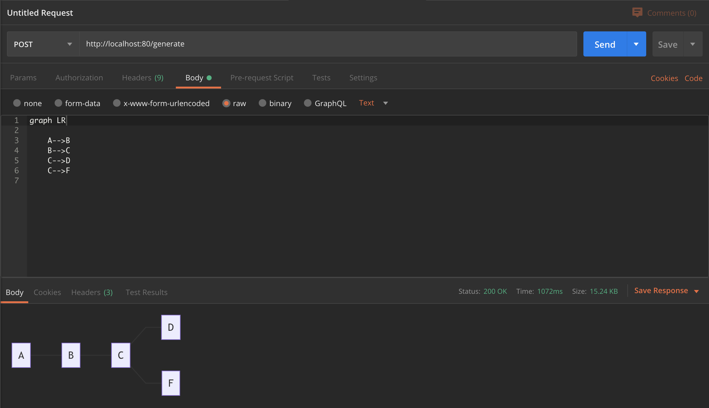

# mermaid-server

Use mermaid-js to generate diagrams in a HTTP endpoint.

While this currently serves the diagrams via HTTP, it could easily be manipulated to server diagrams via other means.

## Basic usage

### Docker

Run the container:
```
docker run -d --name mermaid-server -p 80:80 tomwright/mermaid-server:latest --allow-all-origins=true
```

### Manually as a go command

Start the HTTP server:
```
go run cmd/app/main.go --mermaid=./mermaidcli/node_modules/.bin/mmdc --in=./in --out=./out
```

### Diagram creation

Use the query param 'type' to change between 'png' and 'svg' defaults to 'svg'.

#### POST

Send a CURL request to generate a diagram via `POST`:
```
curl --location --request POST 'http://localhost:80/generate' \
--header 'Content-Type: text/plain' \
--data-raw 'graph LR

    A-->B
    B-->C
    C-->D
    C-->F
'
```

#### GET

Send a CURL request to generate a diagram via `GET`... send in url encoded data under the `data` query param:
```
curl --location --request GET 'http://localhost:80/generate?data=graph%20LR%0A%0A%20%20%20%20A--%3EB%0A%20%20%20%20B--%3EC%0A%20%20%20%20C--%3ED%0A%20%20%20%20C--%3EF%0A'
```



### Caching

All generated diagram input and output will be cached for 1 hour. The cache time is reset whenever a cached diagram is accessed.
 